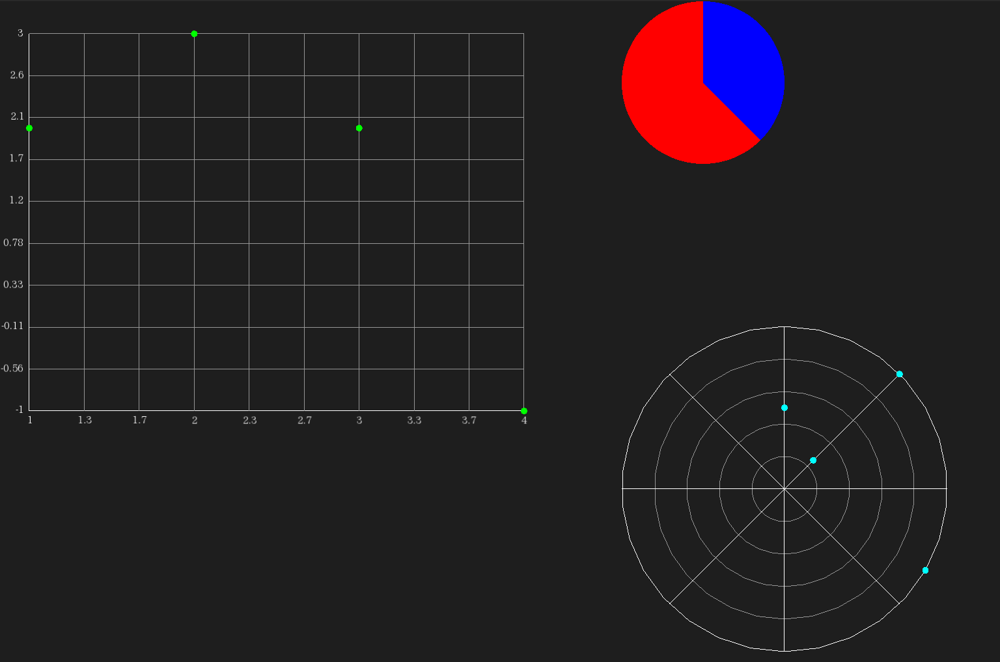

SFPlot
=================================
SFML graph plotting library

<p align="center">


</p>



# Description
Graph plotting library based on SFML multimedia library.
SFPlot supports
1. Cartesian Chart (2D X-Y Chart)
2. Pie Chart
3. Rader Chart
4. Bar Chart
5. Circle Bar Chart

# Building SFPlot
Execute commands below in the top directory of SFPlot.

```
cmake .
make
```

If you want to enable sample program add `-DENABLE_SAMPLE=ON` argument to `cmake` command.

```
cmake -DENABLE_SMAPLE=ON .
make
```

# How to Use
First of all you have to set up default configurations for SFPlot.

```c++
    sf::plot_config.font = font;
    sf::plot_config.font_color = sf::Color::White;
    sf::plot_config.axes_color = sf::Color::White;
    sf::plot_config.scale_color = sf::Color(100.f, 100.f, 100.f);
```

Then declare chart

```c++
    sf::CartesianChart chart; // Catesian X-Y Chart
```

Needless to say, you have to add data set to each chart before drawing to show data.

```c++
    auto data1 = chart.addData();
    data1->data = {{0.f, 100.f}, {45.f, 200.f}, {45.f, 50.f}, {120.f, 200.f}, {90.f, 120.f}};
```

Each Chart class is derived from `sf::Drawable`.
Therefore, you can draw charts on screen in conventional way in SFML.

```c++
window.draw(chart);
window.display();
```

A working example is located in **sample/main.cpp**.
Please check it for the comprehensive example.

# Requirement
* SFML library
* C++ compiler which supports C++17
* CMake

# License
MIT License. Please refer **LICENSE** file for the detail.

# Advice/Contribution/Comment Welcome
I welcome your advice/contribution/comment.
Please feel free to send me message.

Happy Hacking.
