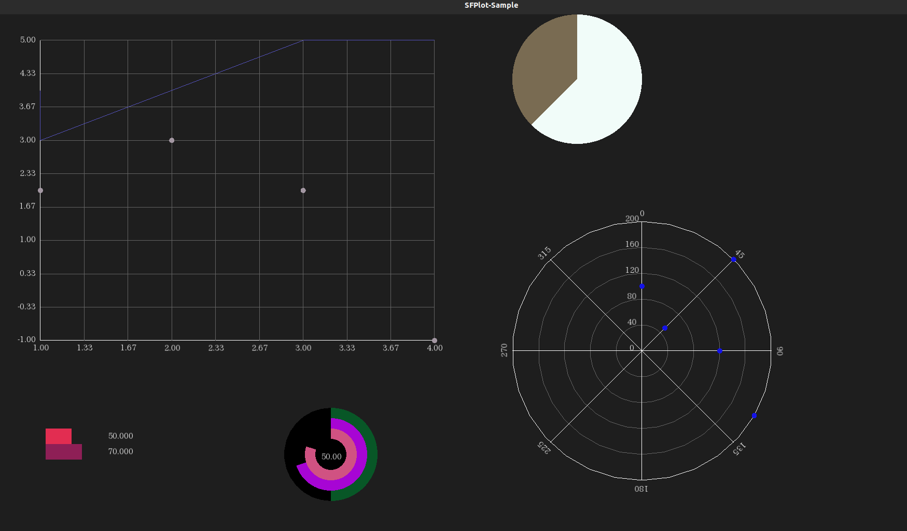

SFPlot
=================================
SFML graph plotting library

# Description
Graph plotting library based on SFML multimedia library.
SFPlot supports
1. Cartesian Chart (2D X-Y Chart)
2. Pie Chart
3. Rader Chart

# Requirement
* SFML library
* C++ compiler which supports C++17

# License
MIT License. Please refer **LICENSE** file for the detail.

# Advice/Contribution/Comment Welcome
I welcome your advice/contribution/comment.
Please feel free to send me message.

Happy Hacking.
